<!-- ======================= HEADER ======================= -->

  

  

  
  

 

<!-- ======================= ABOUT ======================= -->
## 🚀 About Me

- 💻 I build **native Windows apps** (Win32 · WPF · .NET), **full-stack web apps** (Next.js / React + .NET APIs) and **games** (Unity)
- 🎮 I like making tools for gamers and power users — [Sonar-EQ-Changer](https://github.com/AlparslanBurhan/Sonar-EQ-Changer), [EFT-Loot-Tracker](https://github.com/AlparslanBurhan/EFT-Loot-Tracker), [FanPulse](https://github.com/AlparslanBurhan/FanPulse)
- 📡 [LanBeam](https://github.com/AlparslanBurhan/LanBeam) — fast, encrypted LAN file transfer for Windows and macOS
- 🌱 Into **C++ systems programming**, low-latency streaming and device-level Windows APIs
- 📫 Reach me at **alparslanburhan@gmail.com**

 

<!-- ======================= TECH STACK ======================= -->
## 🛠️ Tech Stack

**Languages**

**Frameworks &amp; Libraries**

**Tools &amp; Platforms**

 

<!-- ======================= GITHUB STATS ======================= -->
## 📊 GitHub Stats

  <picture>
    <source media="(prefers-color-scheme: dark)" srcset="assets/stats-dark.svg">
    
  </picture>
  <picture>
    <source media="(prefers-color-scheme: dark)" srcset="assets/languages-dark.svg">
    
  </picture>
  <picture>
    <source media="(prefers-color-scheme: dark)" srcset="assets/activity-dark.svg">
    
  </picture>

 

<!-- ======================= FEATURED PROJECTS ======================= -->
## ⭐ Featured Projects

<!-- PROJECTS:START -->
<!-- PROJECTS:END -->

 

<!-- ======================= FOOTER ======================= -->

### 💬 *"Code is like humor. When you have to explain it, it's bad."*

Every card above is generated by <a href="scripts/generate.mjs">a dependency-free script</a> in GitHub Actions and committed as a static SVG — this README calls no third-party service at page load.

